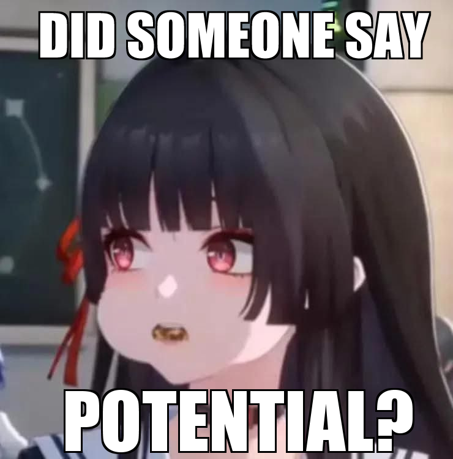
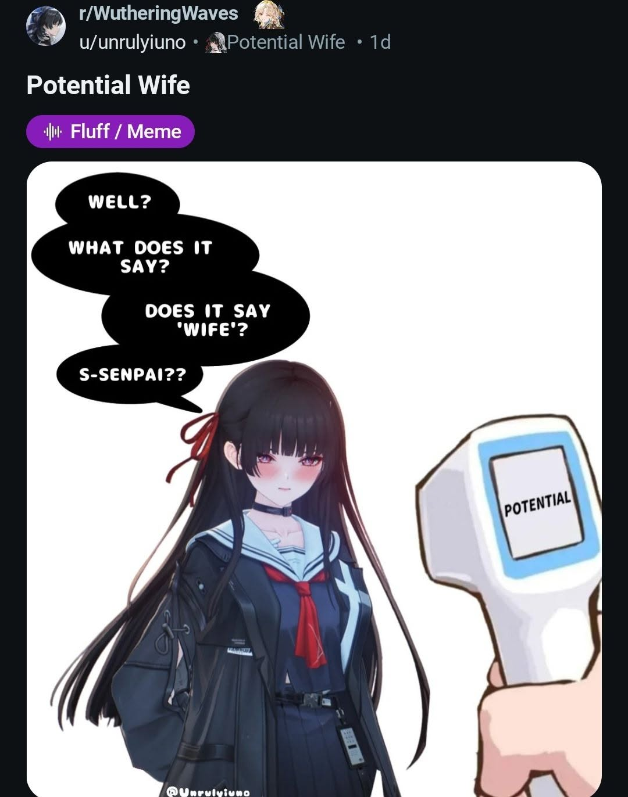

# Messenger Potential Agent - Kuchiba Chisa

<div align="center">



**AI Agent tự động hóa phản hồi tin nhắn Messenger, mang phong cách gái tiềm năng Kuchiba Chisa 👅**

---

</div>

## Giới thiệu tổng quan

**Messenger Potential Agent** là hệ thống AI Agent hoạt động trực tiếp trên máy tính cá nhân của bạn, kết hợp giữa **Computer Vision**, **Mini-RAG** và **LLM DeepSeek** để theo dõi và tự động trò chuyện trên Messenger theo phong cách gái tiềm năng 🗣️🔥🔥.

<div align="center">




</div>

---

## Hướng dẫn cài đặt & Khởi chạy

### 1. Yêu cầu hệ thống
- Hệ điều hành: **Windows 10 / 11**
- **Python 3.10+**
- **Docker Desktop** (để chạy MySQL & Qdrant)

### 2. Cài đặt môi trường
1. Clone dự án và truy cập thư mục:
   ```bash
   git clone <repository_url>
   cd negga-bot
   ```

2. Tạo và kích hoạt môi trường ảo:
   ```bash
   python -m venv venv
   .\venv\Scripts\activate
   ```

3. Cài đặt các thư viện cần thiết:
   ```bash
   pip install -r requirements.txt
   ```

4. Cấu hình file `.env`:
   Tạo file `.env` từ `.env.example` và điền khóa API của bạn:
   ```env
   DEEPSEEK_API_KEY=sk-your-deepseek-api-key
   MYSQL_HOST=localhost
   MYSQL_PORT=3306
   MYSQL_USER=root
   MYSQL_PASSWORD=rootpassword
   MYSQL_DATABASE=messenger_bot
   QDRANT_HOST=localhost
   QDRANT_PORT=6333
   ```

### 3. Khởi động hệ thống
Bạn chỉ cần nhấp đúp vào file **`bot.bat`** (hoặc chạy lệnh):
```cmd
bot.bat
```
Script sẽ tự động:
1. Kiểm tra và kích hoạt các container Docker (MySQL & Qdrant).
2. Tự động đồng bộ cấu trúc cơ sở dữ liệu và vector collection.
3. Mở giao diện Dashboard điều khiển.

---

## Lưu ý
Đây chỉ là dự án mang tính chất thử nghiệm, tôi không chịu bất kỳ trách nhiệm pháp lý nào liên quan đến dự án này.